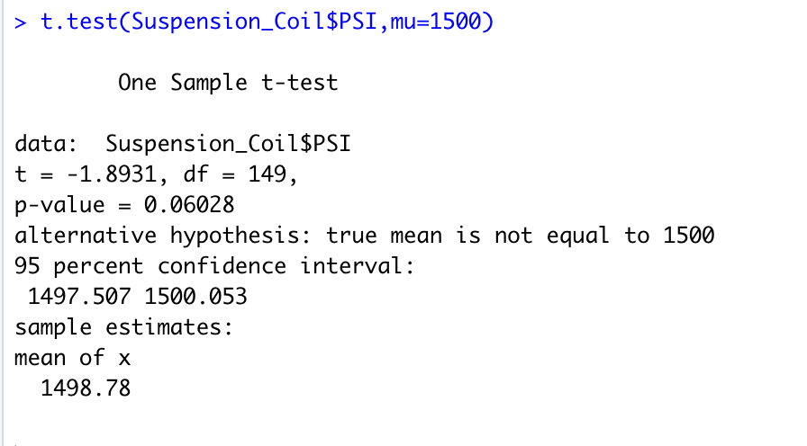

### Overview of Project 

The project is to check car data and to be able to analyze the data to review the production data and provide insights that may help the manufacturing team.

During this project we will do the following:

- perform linear regression analysis to identify which variables in the data predict the mpg of MechaCar prototypes.
- Collecting summary statistics on the pounds per squarch inch of the suspension in the coils from the manufacturing lots.
- Run t-tests to determine if the manufacturing lots are statistically different from the mean population
- Design a statistical study to compare the vehicle performance of the MechaCr vehciles and to be able to compare this data with other vehicles. For each analysis that I find I will provide what I learned from the data and explain the various findings.

- T-test on coils

### Description
# Metric to test
From our data we will evaulate the MechaCar data in cubic inches, and in doing so we will compare the data with other competitiors

# Null and Alternate Hyptothesis
Null: would be that the MechaCar prototype averages carry a capacity that is similar to competitors vehicles that are in the same class. 
Alternate Hypothesis: We could say that the MechaCar prototypes average carrying capacity is statistically above or below the competitors vehicles.

#Statistical test 
The test that was utilized for this was the two-sample t-test

# Data we need
The data that we would need would bethe data that carrys compartments of MechaCar prototypes and from the competitors vehicles.
